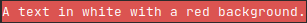
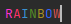

Printing colorful terminal outputs using a builder pattern.

This library is useful for whenever you need to print colorfol something to the terminal.

For example if you need to print a warning into the terminal with red background and white font-color, you could use something like this:

```rust
use terminal_color_builder::OutputFormatter as tcb;

println!(
    "{}",
    tcb::new()
    .fg() // jump to foreground scope
    .hex("#fff") // apply css-hex-color value #fff (white) as foreground color
    .bg() // jump to background scope
    .red() // apply red as background color
    .text_str("A text in white with a red background.") // print text
    .print() // render to string
);
```
Result:  


This is chainable for as long as necessary. Building rainbox-esque outputs through this is absolutely possible.

```rust
use terminal_color_builder::OutputFormatter as tcb;

/// Building a rainbow-colored text
println!(
    "{}",
    tcb::new()
    .fg().hex("#cc33ff").text_str("R") // violet
    .fg().hex("#6633ff").text_str("A") // indigo
    .fg().blue().text_str("I")
    .fg().green().text_str("N")
    .fg().yellow().text_str("B")
    .fg().hex("#ff6633").text_str("O") // orange
    .fg().red().text_str("W")
    .print() // render to string
);
```
This prints the following into the CLI:  
